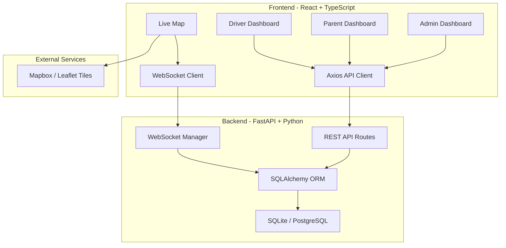
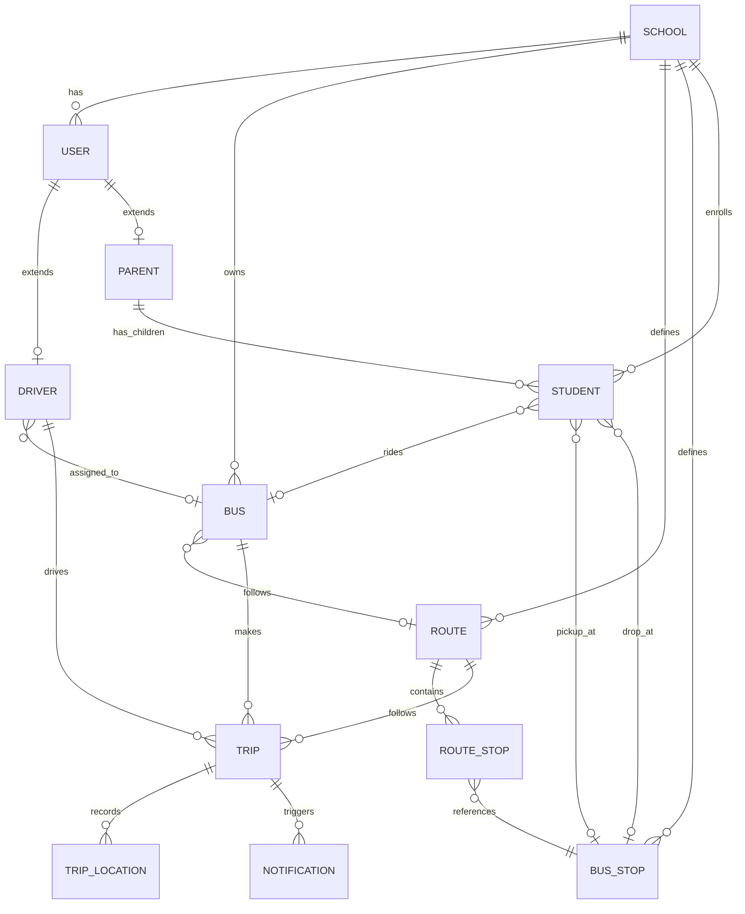
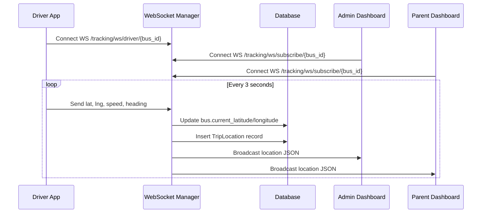

# Smart School Transportation Management System

### Real-Time Bus Tracking & Fleet Management Platform

---

**Project Report**

**Submitted by:** [Your Name]
**Institution:** [Your College / University]
**Date:** August 2026

---

## Table of Contents

1. [Introduction](#1-introduction)
2. [Problem Statement & Objectives](#2-problem-statement--objectives)
3. [Technology Stack](#3-technology-stack)
4. [System Architecture](#4-system-architecture)
5. [Database Design](#5-database-design)
6. [API Design (Backend)](#6-api-design-backend)
7. [Frontend Design](#7-frontend-design)
8. [How It Works — Core Logic](#8-how-it-works--core-logic)
9. [Project Startup Guide](#9-project-startup-guide)
10. [Future Scope](#10-future-scope)
11. [Conclusion](#11-conclusion)

---

## 1. Introduction

School bus safety is one of the most pressing concerns for parents and educational institutions in India. Every day, millions of students travel in school buses, and parents are left anxious until their child reaches home. Traditional systems rely on phone calls between parents, drivers, and school administrators — a process that is unreliable, unscalable, and lacks real-time visibility.

The **Smart School Transportation Management System** is a modern, full-stack SaaS web platform designed to solve this problem. It provides real-time GPS tracking of school buses, fleet management for administrators, and a connected dashboard for parents to monitor their child's bus in real-time.

The platform is built with a production-grade architecture using **FastAPI** (Python) on the backend and **React + TypeScript** on the frontend, with WebSocket-based live GPS streaming, role-based access control, and a premium dark-themed dashboard UI.

### Key Features

| Feature | Description |
|---|---|
| **Live GPS Tracking** | Real-time bus location on an interactive map via WebSocket streaming |
| **Role-Based Access** | 4 user roles: Super Admin, School Admin, Driver, Parent |
| **Entity Interconnection** | Parent - Student - Bus - Driver - Route — fully connected |
| **Fleet Management** | CRUD operations for buses, routes, stops, drivers, students |
| **Trip Management** | Start, track, and end trips with full GPS history |
| **Parent Dashboard** | Parents see their child's bus, driver contact, route, and live GPS |
| **Driver Dashboard** | Drivers see assigned students, parents, and route info |
| **Notifications** | Trip started, trip ended, bus near stop, overspeed alerts |
| **Docker Deployment** | Full Docker Compose setup for production deployment |

---

## 2. Problem Statement & Objectives

### 2.1 Problem Statement

In the current scenario, schools in India manage their transport fleets using paper registers, WhatsApp groups, and phone calls. This creates the following problems:

- **No real-time visibility** — Parents do not know where the bus is at any given moment.
- **No centralized management** — Bus assignments, driver records, and route planning are done manually.
- **Safety concerns** — There is no way to detect overspeed, route deviations, or delays automatically.
- **Communication gaps** — Parents cannot contact the driver directly; they must call the school office first.
- **Scalability issues** — Manual processes break down as the number of buses and students increases.

### 2.2 Objectives

1. Build a real-time GPS tracking system that streams bus locations to parents and admins via WebSockets.
2. Create a role-based multi-tenant platform supporting multiple schools.
3. Implement a relational interconnection model where every entity (Parent, Student, Bus, Driver, Route, Stop) is connected.
4. Provide a premium, modern SaaS-style admin dashboard for fleet management.
5. Enable parents to see their child's bus, driver info (with click-to-call), route, and live GPS in one unified view.
6. Deploy the system using Docker for production readiness.

---

## 3. Technology Stack

### 3.1 Backend

| Technology | Purpose | Version |
|---|---|---|
| **Python** | Primary language | 3.14 |
| **FastAPI** | Async web framework | 0.115.12 |
| **SQLAlchemy** | Async ORM | 2.0.41 |
| **SQLite / PostgreSQL** | Database (dev / prod) | — |
| **aiosqlite** | Async SQLite driver | 0.21.0 |
| **asyncpg** | Async PostgreSQL driver | 0.30.0 |
| **Pydantic v2** | Data validation and serialization | 2.11.7 |
| **python-jose** | JWT token generation and verification | 3.4.0 |
| **passlib + bcrypt** | Password hashing | 1.7.4 |
| **WebSockets** | Real-time GPS streaming | 15.0.1 |
| **Uvicorn** | ASGI production server | 0.34.3 |

### 3.2 Frontend

| Technology | Purpose | Version |
|---|---|---|
| **React** | UI framework | 19.2.8 |
| **TypeScript** | Type-safe JavaScript | 6.0.2 |
| **Vite** | Build tool and dev server | 8.2.0 |
| **TailwindCSS** | Utility-first CSS framework | 3.4.19 |
| **Zustand** | Lightweight state management | 5.0.14 |
| **React Query** | Server state + data fetching | 5.101.4 |
| **React Router** | Client-side routing | 7.18.2 |
| **Framer Motion** | Animations and transitions | 12.43.0 |
| **Leaflet / Mapbox GL** | Interactive maps | 1.9.4 / 3.27.0 |
| **Recharts** | Dashboard charts | 3.10.1 |
| **React Hook Form + Zod** | Form handling + validation | 7.83.0 / 3.25.76 |
| **Lucide React** | Icon library | 1.28.0 |
| **Axios** | HTTP client | 1.19.0 |

### 3.3 DevOps and Deployment

| Technology | Purpose |
|---|---|
| **Docker** | Containerization |
| **Docker Compose** | Multi-service orchestration (Frontend + Backend + PostgreSQL) |
| **Nginx** | Reverse proxy for frontend |

---

## 4. System Architecture

### 4.1 High-Level Architecture



### 4.2 Architecture Layers

| Layer | Technology | Responsibility |
|---|---|---|
| **Presentation** | React + TailwindCSS | User interface, forms, maps, charts |
| **Client State** | Zustand + React Query | Auth state, server data caching |
| **API Gateway** | Axios + JWT Interceptor | HTTP requests with auto-auth |
| **Application** | FastAPI Routes | Business logic, validation, auth |
| **Real-Time** | WebSocket Manager | GPS broadcast to subscribers |
| **Data Access** | SQLAlchemy Async ORM | Database queries and mutations |
| **Persistence** | SQLite (dev) / PostgreSQL (prod) | Data storage |

---

## 5. Database Design

### 5.1 Entity-Relationship Diagram



### 5.2 Table Descriptions

| Table | Description | Key Fields |
|---|---|---|
| **schools** | Registered schools | name, address, city, state, phone, email |
| **users** | Unified user table | email, password_hash, full_name, role, school_id |
| **drivers** | Driver profile (extends User) | user_id, license_number, assigned_bus_id, status |
| **parents** | Parent profile (extends User) | user_id, address, alternate_phone |
| **buses** | School bus vehicles | bus_number, registration_number, capacity, assigned_route_id, current_lat/lng |
| **routes** | Transport routes | name, description, estimated_duration, estimated_distance |
| **bus_stops** | GPS-located stops | name, latitude, longitude, address |
| **route_stops** | Route to Stop junction | route_id, stop_id, sequence_order, estimated_arrival |
| **students** | Enrolled students | full_name, class, section, parent_id, assigned_bus_id, pickup/drop_stop_id |
| **trips** | Bus journeys | bus_id, driver_id, route_id, status, trip_type, started_at, ended_at |
| **trip_locations** | GPS breadcrumbs | trip_id, latitude, longitude, speed, heading, recorded_at |
| **notifications** | System alerts | user_id, title, message, type, is_read, trip_id |

### 5.3 Key Interconnection Chain

The most important design decision is the **Bus as the central hub**:

```
Parent --> Student --> Bus <-- Driver
                       |
                     Route --> Stops
```

A parent's child rides a bus, that bus has a driver, so the parent and driver are connected **through the bus**. This is queried using eager-loaded SQLAlchemy relationships in a single database query.

---

## 6. API Design (Backend)

### 6.1 API Prefix and Authentication

- All endpoints are prefixed with `/api/v1/`
- Authentication uses **JWT Bearer tokens** with 8-hour expiry
- Tokens are issued at `POST /api/v1/auth/login`
- Role-based access is enforced using FastAPI `Depends()` dependency injection

### 6.2 Endpoint Summary

| Module | Endpoints | Auth | Description |
|---|---|---|---|
| **Auth** | `POST /auth/login`, `GET /auth/me` | Public / JWT | Login and fetch current user |
| **Schools** | `GET/POST/PATCH /schools` | Admin | School CRUD |
| **Users** | `GET/POST/PATCH /users` | Admin | User management |
| **Buses** | `GET/POST/PATCH /buses` | Admin | Fleet management |
| **Drivers** | `GET/POST/PATCH /drivers` | Admin | Driver management |
| **Students** | `GET/POST/PATCH /students` | Admin | Student enrollment |
| **Routes** | `GET/POST/PATCH /routes` | Admin | Route and stop management |
| **Parents** | `GET /parents/me/bus-info` | Parent | Child's bus/driver/route info |
| **Tracking** | `POST /tracking/trips/start`, `GET /tracking/parent-view` | JWT | Trip lifecycle + parent GPS view |
| **Dashboard** | `GET /dashboard/stats` | Admin | Aggregated statistics |
| **WebSocket** | `WS /tracking/ws/driver/{bus_id}` | Token | Driver GPS stream |
| **WebSocket** | `WS /tracking/ws/subscribe/{bus_id}` | Token | Admin/parent GPS subscription |

### 6.3 Interconnection Endpoints

These special endpoints traverse the full entity chain:

```
GET /parents/me/bus-info
  Chain: Parent --> Children --> Bus --> Driver --> Route --> Stops + Live GPS
  Returns: ParentBusInfoResponse { parent_name, children[] }

GET /drivers/{id}/connections
  Chain: Driver --> Bus --> Students --> Parents
  Returns: DriverConnectionsResponse { driver_name, bus_number, route_name, students[] }

GET /tracking/parent-view
  Chain: Parent --> Children --> Buses --> GPS + Driver Info
  Returns: { buses: [{ bus_id, latitude, longitude, driver_name, children_on_bus }] }
```

---

## 7. Frontend Design

### 7.1 Page Structure

| Page | Route | Roles | Description |
|---|---|---|---|
| Login | `/login` | All | Premium glass-morphism login with animated bus |
| Admin Dashboard | `/dashboard` | Admin | Stats cards, charts, active trips overview |
| Users | `/users` | Admin | User table with search, create, edit |
| Buses | `/buses` | Admin | Fleet cards with status, capacity, route assignment |
| Drivers | `/drivers` | Admin | Driver cards with connections modal |
| Students | `/students` | Admin | Student table with bus/stop assignments |
| Routes | `/routes` | Admin | Route list with stop sequence editor |
| Live Tracking | `/tracking` | Admin | Full-screen Leaflet map with bus markers |
| Trips | `/trips` | Admin | Trip history with GPS replay |
| **Parent Dashboard** | `/parent` | Parent | Child cards with bus, driver, route, live GPS |
| **Driver Dashboard** | `/driver` | Driver | Assigned bus, students, route info |

### 7.2 Design Philosophy

The frontend follows a **premium SaaS aesthetic** with:

- **Dark sidebar navigation** with role-based filtering and active state indicators
- **Glassmorphism** effects on login and modal overlays
- **Micro-animations** using Framer Motion for card entrances, skeleton loaders, and page transitions
- **Responsive grid layouts** that adapt from mobile to desktop
- **Color-coded status badges** (green=active, blue=on_trip, amber=maintenance, gray=inactive)
- **Consistent design tokens** via TailwindCSS custom theme (brand-500, gray-800, etc.)

### 7.3 State Management

| Library | Purpose |
|---|---|
| **Zustand** | Client-side auth state (user, token, login/logout actions) |
| **React Query** | Server state caching, auto-refetch, pagination, mutations |
| **React Hook Form + Zod** | Form state with schema-based validation |

---

## 8. How It Works — Core Logic

### 8.1 Live GPS Tracking Flow



**How the WebSocket Manager works:**

1. The `ConnectionManager` maintains two dictionaries:
   - `_bus_subscribers: {bus_id -> set[WebSocket]}` — admins and parents watching a bus
   - `_driver_connections: {driver_id -> WebSocket}` — the driver sending GPS
2. When a driver sends a GPS update, the manager broadcasts it to **all subscribers** of that bus.
3. It also stores the latest location in memory (`_latest_locations`) so new subscribers get the current position immediately upon connecting.
4. Dead connections are automatically cleaned up.

### 8.2 Entity Interconnection Logic

The interconnection between parents and drivers works **through the bus** as the central hub:

```
Step 1: Parent logs in -> get parent_id from users table
Step 2: Query students WHERE parent_id = parent_id
Step 3: For each student, follow assigned_bus_id -> buses table
Step 4: From bus, follow assigned_driver -> drivers table -> users table (name, phone)
Step 5: From bus, follow assigned_route_id -> routes table (route name)
Step 6: From student, follow pickup_stop_id/drop_stop_id -> bus_stops table
Step 7: From bus, read current_latitude/current_longitude (live GPS)
```

All of this is done in a **single SQLAlchemy query** using `selectinload()` for eager loading, which avoids N+1 query problems.

### 8.3 Authentication Flow

```
1. User submits email + password to POST /auth/login
2. Server verifies password using bcrypt hash comparison
3. Server generates a JWT token containing { user_id, role, exp }
4. Token is returned to frontend and stored in localStorage
5. Axios interceptor attaches "Authorization: Bearer {token}" to every request
6. FastAPI Depends(get_current_user) decodes the JWT on each protected route
7. Role-based guards (require_school_admin) enforce access control
8. On 401, the Axios interceptor clears the token and redirects to /login
```

---

## 9. Project Startup Guide

### 9.1 Prerequisites

- **Python 3.12+** installed
- **Node.js 18+** installed
- **Git** installed

### 9.2 Clone the Repository

```bash
git clone https://github.com/your-username/Real-Time-Bus-Tracker.git
cd Real-Time-Bus-Tracker
```

### 9.3 Backend Setup

```bash
# Navigate to backend
cd backend

# Create virtual environment (recommended)
python -m venv venv
venv\Scripts\activate        # Windows
# source venv/bin/activate   # macOS/Linux

# Install dependencies
pip install -r requirements.txt

# Start the backend server
python -m uvicorn app.main:app --host 0.0.0.0 --port 8000 --reload
```

The backend will automatically:
- Create all database tables on first startup
- Seed demo data (admin, drivers, parents, students, buses, routes)
- Serve the API at `http://localhost:8000`
- Serve API docs at `http://localhost:8000/docs` (Swagger UI)

### 9.4 Frontend Setup

```bash
# Open a new terminal window
cd frontend

# Install dependencies
npm install

# Start the dev server
npm run dev -- --host
```

The frontend will be available at `http://localhost:5173`.

### 9.5 Default Login Credentials

| Role | Email | Password |
|---|---|---|
| Super Admin | `superadmin@smarttransport.com` | `admin123` |
| School Admin | `admin@greenfield.edu.in` | `admin123` |
| Driver | `driver1@greenfield.edu.in` | `driver123` |
| Parent | `parent1@gmail.com` | `parent123` |

### 9.6 Docker Deployment (Production)

```bash
cd docker
docker-compose up -d --build
```

This starts three containers:
- **PostgreSQL 16** database on port 5432
- **FastAPI backend** on port 8000
- **Nginx + React frontend** on port 80

### 9.7 Environment Variables

The `.env` file at the project root controls all configuration:

| Variable | Description | Default |
|---|---|---|
| `DATABASE_URL` | Database connection string | `sqlite+aiosqlite:///./transport.db` |
| `JWT_SECRET_KEY` | Secret key for JWT signing | (change in production) |
| `JWT_ACCESS_TOKEN_EXPIRE_MINUTES` | Token validity in minutes | `480` (8 hours) |
| `CORS_ORIGINS` | Allowed frontend origins | `["http://localhost:5173"]` |
| `MAPBOX_ACCESS_TOKEN` | Mapbox API key for maps | (optional) |
| `GPS_UPDATE_INTERVAL_SECONDS` | GPS stream frequency | `3` |
| `OVERSPEED_LIMIT_KMH` | Speed alert threshold | `60.0` |

---

## 10. Future Scope

### 10.1 Short-Term Enhancements

| Feature | Description |
|---|---|
| **Mobile App (React Native)** | Native Android/iOS app for parents and drivers with push notifications |
| **Geofencing Alerts** | Automatically notify parents when the bus enters/exits a geo-zone around their stop |
| **ETA Predictions** | Use historical trip data + Google Maps API to estimate arrival time at each stop |
| **Attendance Tracking** | RFID or QR-code based student check-in/check-out at bus door |
| **Route Optimization** | Use AI algorithms to optimize bus routes for minimal travel time and fuel cost |

### 10.2 Medium-Term Enhancements

| Feature | Description |
|---|---|
| **Multi-Tenant SaaS** | Allow multiple schools to register and manage independently on a single platform |
| **Parent Chat** | In-app messaging between parents and school admin |
| **OBD-II Integration** | Read vehicle diagnostics (fuel, engine health) via OBD-II hardware dongle |
| **Video Surveillance** | Integrate live CCTV feed from bus cameras into the dashboard |
| **Panic Button** | Driver can trigger an emergency alert that notifies school admin and all parents instantly |

### 10.3 Long-Term Vision

| Feature | Description |
|---|---|
| **AI-Powered Analytics** | Predict maintenance needs, identify unsafe driving patterns, optimize fleet allocation |
| **Government Compliance** | Auto-generate RTO reports, pollution certificates, and safety audit logs |
| **Payment Integration** | Online transport fee payment with Razorpay/UPI integration |
| **Carbon Footprint Tracker** | Track and report CO2 emissions per bus, per route |
| **Multi-Language Support** | Hindi, Marathi, Tamil, and other regional language interfaces |

---

## 11. Conclusion

The **Smart School Transportation Management System** successfully addresses the critical gap in school bus safety and fleet management in India. By combining real-time GPS tracking, role-based dashboards, and entity interconnection logic, the platform provides a comprehensive solution that benefits all stakeholders:

- **Parents** gain peace of mind with live bus tracking, driver contact info, and route visibility.
- **School Administrators** get a powerful fleet management tool with real-time oversight.
- **Drivers** have a clear view of their assigned students and route details.

The system is built with production-grade technologies (FastAPI, React, WebSockets, PostgreSQL) and follows modern software engineering practices including async programming, JWT authentication, ORM-based data access, and containerized deployment.

The architecture is designed to be extensible — adding features like mobile apps, geofencing, or AI analytics requires no changes to the core database schema, only new endpoints and UI components.

This project demonstrates a real-world application of full-stack development, real-time systems, and SaaS design principles.

---

**References**

1. FastAPI Documentation — https://fastapi.tiangolo.com/
2. React Documentation — https://react.dev/
3. SQLAlchemy Async ORM — https://docs.sqlalchemy.org/en/20/orm/extensions/asyncio.html
4. WebSocket Protocol (RFC 6455) — https://tools.ietf.org/html/rfc6455
5. Leaflet.js Maps — https://leafletjs.com/
6. TailwindCSS — https://tailwindcss.com/
7. Docker Documentation — https://docs.docker.com/

---

*This document was prepared as part of the project submission for the Smart School Transportation Management System.*
