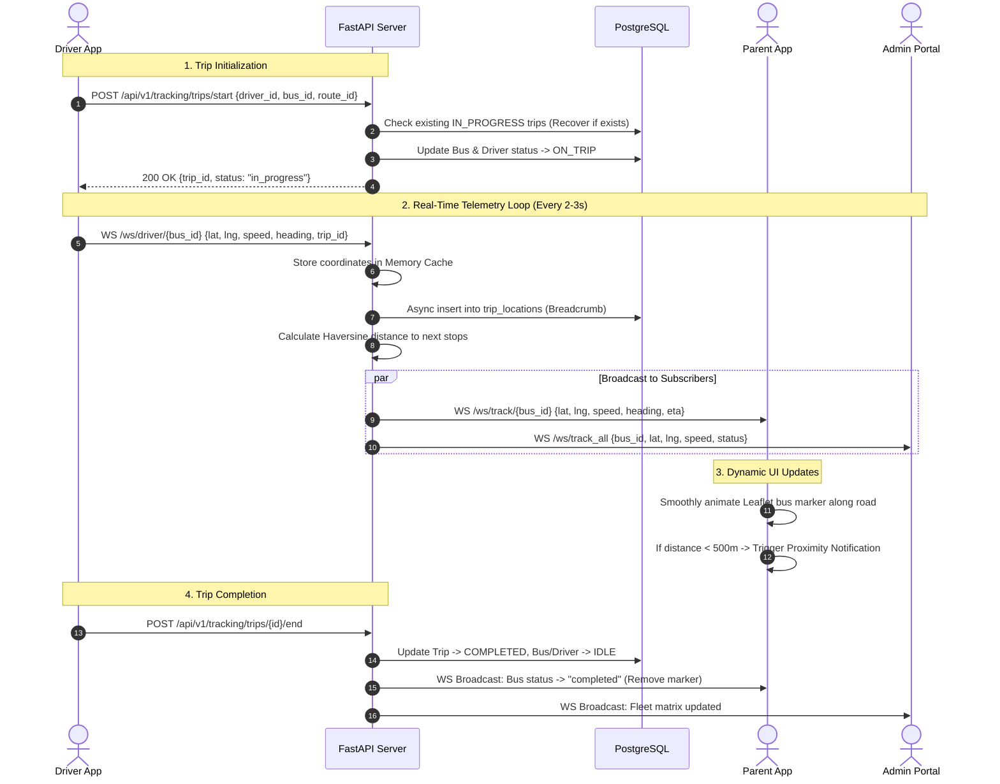

# 🚌 YellowBird — Real-Time School Bus Tracking System

<div align="center">

**A production-grade, zero-hardware school bus tracking and fleet management ecosystem with real-time GPS streaming, standalone Android mobile apps, desktop administrator portals, and parent arrival notifications.**

[](#-technology-stack)
[-009688?logo=fastapi&logoColor=white)](#-technology-stack)
[](#-native-android-mobile-app)
[](#-desktop-admin-app-electron)
[](#-real-time-websocket-architecture)
[](#-database-architecture)
[](#-license--intellectual-property-rights)

</div>

---

## 📖 Table of Contents

- [Executive Overview](#-executive-overview)
- [Key Features & Capabilities](#-key-features--capabilities)
- [End-to-End System Architecture](#-end-to-end-system-architecture)
- [Data Flow & Telemetry Pipeline](#-data-flow--telemetry-pipeline)
- [User Roles & Experience Portals](#-user-roles--experience-portals)
  - [Driver Experience](#1-driver-mobile-experience)
  - [Parent Experience](#2-parent-mobile--web-experience)
  - [School Administrator Experience](#3-school-administrator-portal)
  - [Super Administrator Experience](#4-super-administrator-portal)
- [Core Engineering & Architecture Logic](#-core-engineering--architecture-logic)
  - [Real-Time WebSocket Engine](#1-real-time-websocket-engine)
  - [Trip Lifecycle & Safety Architecture](#2-trip-lifecycle--safety-architecture)
  - [Driver Trip Logout Guard](#3-driver-trip-logout-guard)
  - [Crash-Proof Excel Bulk Ingestion Pipeline](#4-crash-proof-excel-bulk-ingestion-pipeline)
  - [Admin Session Isolation Guard](#5-admin-session-isolation-guard)
  - [Pagination & Server State Synchronization](#6-pagination--server-state-synchronization)
- [Technology Stack](#-technology-stack)
- [Project Directory Structure](#-project-directory-structure)
- [Native Android Mobile App](#-native-android-mobile-app)
- [Desktop Admin App (Electron)](#-desktop-admin-app-electron)
- [Cloud & Production Deployments](#-cloud--production-deployments)
- [Getting Started & Local Setup](#-getting-started--local-setup)
  - [Prerequisites](#prerequisites)
  - [1. Backend Setup](#1-backend-setup)
  - [2. Frontend Web Setup](#2-frontend-web-setup)
  - [3. Android APK Compilation](#3-android-apk-compilation)
  - [4. Docker Deployment](#4-docker-deployment)
- [Network & Field Testing Modes](#-network--field-testing-modes)
- [Complete API Reference](#-complete-api-reference)
- [Demo Credentials](#-demo-credentials)
- [Troubleshooting & FAQ](#-troubleshooting--faq)
- [License](#-license)

---

## 🎯 Executive Overview

Traditional school transportation tracking systems rely on expensive hardware GPS black-boxes wired directly into vehicle batteries. These devices require costly SIM card subscriptions, physical installation downtime, high upfront capital expenditure, and frequent technician maintenance.

**YellowBird completely eliminates hardware overhead through a pure software-driven architecture:**

1. **Zero Hardware Investment**: Converts any driver's existing smartphone into a precision GPS telemetry transmitter using native browser and Capacitor Geolocation APIs.
2. **Sub-Second Streaming**: Pushes location, heading, velocity, and accuracy data over persistent full-duplex WebSockets every 2–3 seconds.
3. **Ghost-Free Tracking**: Buses are rendered on parent maps **strictly** when a trip is active and streaming live coordinates. Stale, offline, or parked buses never clutter the parent interface.
4. **Consumer-Grade Reliability**: Built-in state recovery, screen wake lock, nested database savepoints, and session guards guarantee that unstable cellular signals, accidental reboots, or malformed data will not disrupt school operations.
5. **Cross-Platform Ecosystem**: A unified modern codebase delivering responsive web dashboards, native Android APKs, and dedicated Windows Electron desktop executables.

---

## ✨ Key Features & Capabilities

### 🚌 Driver Experience
- **One-Tap Trip Operation**: Single-button activation to start and complete scheduled bus routes.
- **Continuous Background Transmission**: Screen wake lock prevents the OS from suspending GPS services while the bus is in transit.
- **Fail-Safe Session Recovery**: Trips survive phone lock, browser refresh, process kills, and app reboots via persisted local state (`yb_active_trip`) paired with server state reconciliation (`GET /api/v1/tracking/trips/my-active`).
- **Logout Lock Guard**: Sign-out button is physically disabled with an amber warning banner during active trips; idle sign-outs require animated confirmation to avoid accidental disconnects.
- **Speed Monitoring**: Built-in speed tracking alerts when vehicles exceed safety thresholds (default 60 km/h).
- **Single-Device Enforcement**: Driver accounts are locked to a single active session token (`session_token`), preventing multiple phones from transmitting conflicting coordinates.

### 👨‍👩‍👧 Parent Experience
- **Live Interactive Map**: Powered by Leaflet with smooth coordinate interpolation, dynamic rotation angles, and custom bus markers.
- **Accurate Real-Time ETA**: Dynamic Haversine algorithms recalculate driving distance and estimated time of arrival to the student's designated pickup/drop stop.
- **Proximity Audio & Visual Alerts**: Triggers notifications when the vehicle crosses the 500-meter proximity threshold of the student's stop.
- **Instant Map Center**: Tapping the "Refresh" button instantly re-centers and snaps the map directly onto the parent's current position or the moving bus.
- **Multi-Child Switcher**: Parents with multiple enrolled children can seamlessly toggle between buses with a single tap.
- **One-Tap Driver Calling**: Direct cellular phone link on the tracking card allows parents to call the assigned driver instantly without searching contacts.

### 🏫 School Administrator Experience
- **Live Fleet Control Center**: Real-time status matrix showing all buses, routes, drivers, and on-trip indicators on a unified live map.
- **Crash-Proof Excel Bulk Upload**: Seamlessly import hundreds of students and parents with nested database savepoints (`SAVEPOINT`), automatic duplicate deduplication, and cached bcrypt hashing.
- **Complete Rosters with Pagination**: Parents and Students directories include 20/50/100 page size options, page numbers, search filters, and one-click manual refresh.
- **Interactive Route & Stop Builder**: Design bus routes, sequence pickup stops, and assign geocoordinates directly on the map.
- **Student-Bus-Stop Assignment**: Connect students to specific parents, buses, pickup stops, and drop stops for complete end-to-end accountability.

---

## 🏗️ End-to-End System Architecture

```mermaid
flowchart TB
    subgraph MobileDriver["Driver Mobile App (Android / Web)"]
        D_GPS["@capacitor/geolocation\nHigh Accuracy GPS Engine"]
        D_Store["Zustand Trip Store\nLocalStorage Backup"]
        D_Wake["Screen Wake Lock API"]
        D_WS["Native WebSocket Client\nAuto-Reconnect Engine"]
        
        D_GPS -->|Lat, Lng, Speed, Bearing| D_Store
        D_Store -->|Payload Every 2-3s| D_WS
        D_Wake -.->|Keep Awake| D_GPS
    end

    subgraph CloudBackend["FastAPI Backend Server (Render / Cloud)"]
        WS_MGR["WebSocket ConnectionManager\nChannel Router & In-Memory Cache"]
        API_ROUTER["FastAPI REST Endpoints\nRBAC & Session Validation"]
        GEO_ENGINE["Routing & Proximity Engine\nHaversine Distance & Stop Detection"]
        ORM["SQLAlchemy 2.0 (Async)\nSavepoints & Atomic Transactions"]
        
        D_WS -->|/api/v1/tracking/ws/driver/{bus_id}| WS_MGR
        WS_MGR -->|Telemetry Ingestion| GEO_ENGINE
        GEO_ENGINE -->|Persist Breadcrumbs| ORM
        API_ROUTER <-->|Async Queries| ORM
    end

    subgraph DatabaseEngine["Database Storage"]
        DB[(PostgreSQL + asyncpg\nSQLite for Dev)]
        ORM <--> DB
    end

    subgraph ClientConsumers["Consumers & Portals"]
        subgraph ParentApp["Parent Portal (Android / Mobile Web)"]
            P_WS["WebSocket Subscriber Client"]
            P_Map["Leaflet Map\nSmooth Marker Interpolation"]
            P_UI["Live ETA & Stop Notifications"]
            P_WS --> P_UI
            P_UI --> P_Map
        end

        subgraph AdminPortal["Admin Portal (Desktop Electron / Web)"]
            A_WS["WebSocket Global Fleet Client"]
            A_UI["Fleet Radar & Management Dashboard"]
            A_WS --> A_UI
        end
    end

    WS_MGR -->|/api/v1/tracking/ws/track/{bus_id}| P_WS
    WS_MGR -->|/api/v1/tracking/ws/track_all| A_WS
    API_ROUTER -.->|REST Queries| ParentApp
    API_ROUTER -.->|REST Queries| AdminPortal
```

---

## 🔄 Data Flow & Telemetry Pipeline



---

## 👥 User Roles & Experience Portals

```
┌──────────────────────────────────────────────────────────────────────────────┐
│                            YellowBird Platform                               │
├────────────────────┬────────────────────┬──────────────────┬─────────────────┤
│    Super Admin     │    School Admin    │      Driver      │     Parent      │
├────────────────────┼────────────────────┼──────────────────┼─────────────────┤
│ • Multi-school     │ • Fleet Management │ • 1-Tap Trip     │ • Live Bus Map  │
│ • System analytics │ • Driver/Bus pair  │ • Auto-GPS Stream│ • Dynamic ETA   │
│ • Tenant creation  │ • Route / Stop Seq │ • Passenger List │ • Proximity Bell│
│ • Platform health  │ • Excel Bulk Upload│ • Screen WakeLock│ • Direct Calling│
│ • Global oversight │ • Desktop App Exe  │ • Trip Safe Lock │ • Multi-Child   │
└────────────────────┴────────────────────┴──────────────────┴─────────────────┘
```

### 1. Driver Mobile Experience
- **Designed for Road Safety**: High-contrast, large-touch interfaces optimized for in-vehicle mounted smartphones.
- **Driver Profile & Preferences**: Audio alerts toggle, night mode, assigned bus specifications, and active school selection.
- **Interactive Student Manifest**: Check off students as they board and disembark at designated route stops.
- **Route Stop Sequence**: Step-by-step stop overview with student counts and scheduled times.

### 2. Parent Mobile & Web Experience
- **Live Visual Tracking**: Watch the bus glide smoothly on road networks with directional heading arrow markers.
- **Zero Confusion Guarantee**: When the bus is offline, a clear informative card states *"Bus is currently offline / awaiting departure"*, and the map safely centers on the parent's home stop.
- **Student Profile**: Shows assigned bus number, driver photo/name, route name, pickup stop, and drop stop.

### 3. School Administrator Portal
- **Fleet Radar**: High-density interactive map showing every operating vehicle in the district.
- **Excel Ingestion Hub**: Upload spreadsheets containing parents and students in seconds.
- **Role Administration**: Create and manage credentials for drivers, staff, and parents.
- **Exportable Metrics**: View completed trip logs, duration, average speeds, and mileage.

### 4. Super Administrator Portal
- **Multi-Tenant Hierarchy**: Create and isolate multiple independent school branches or school districts.
- **Global Overview**: Real-time cross-school metrics and active vehicle counters.

---

## ⚙️ Core Engineering & Architecture Logic

### 1. Real-Time WebSocket Engine
YellowBird avoids polling delays and server load by utilizing native WebSockets through an async `ConnectionManager`:
- **Driver Channel** (`/api/v1/tracking/ws/driver/{bus_id}?token={JWT}`): Authenticates driver credentials and accepts telemetry packets every 2–3 seconds.
- **Parent Channel** (`/api/v1/tracking/ws/track/{bus_id}`): Dispatches targeted location updates directly to parents linked to that specific bus.
- **Fleet Broadcast Channel** (`/api/v1/tracking/ws/track_all`): Delivers lightweight telemetry arrays across all active vehicles to administrative monitors.
- **Graceful Reconnection**: Both driver and parent frontend stores automatically attempt exponential backoff reconnection if mobile cellular connectivity flickers in dead zones.

### 2. Trip Lifecycle & Safety Architecture
- **Automatic Recovery on Launch**: When a driver opens the app, `GET /api/v1/tracking/trips/my-active` queries the database. If an in-progress trip exists, the client resumes the active UI state and location tracking automatically without driver intervention.
- **Duplicate Prevention**: Calling `POST /api/v1/tracking/trips/start` checks for existing active trips for the driver and returns the ongoing trip rather than creating redundant database records.
- **Stale Trip Auto-Cleanup**: The system automatically completes any abandoned trip older than 12 hours, ensuring the fleet remains synchronized.
- **Timezone Normalization**: All database timestamp comparisons utilize UTC conversion (`_calculate_trip_age_hours`), avoiding errors across SQLite naive dates and timezone-aware objects.

### 3. Driver Trip Logout Guard
Drivers must never accidentally sign out while carrying students:
- **State Audit**: [DriverProfileTab.tsx](file:///d:/Real-Time-Bus-Tracker-main/frontend/src/pages/driver/DriverProfileTab.tsx) observes `currentTrip` and `isTracking` from `useTripStore`.
- **Physical Lockout**: While a trip is in progress, the "Sign Out" button is visually disabled (greyed out, `cursor-not-allowed`) and accompanied by an amber alert banner: *"Sign out is disabled while a trip is running. End the trip first."*
- **Accidental Click Interception**: If tapped, a toast alert blocks execution.
- **Confirmation Modal**: When idle, tapping "Sign Out" opens a confirmation modal with "Cancel" and "Yes, Sign Out" options to prevent accidental logouts.

### 4. Crash-Proof Excel Bulk Ingestion Pipeline
To allow administrators to upload entire school rosters without technical failures:
- **Supported Columns**:
  - Parents: `Parent Name`, `Email`, `Password`
  - Students: `Student Name`, `Class`, `Section`, `Roll No`
- **Case-Insensitive & Whitespace Trimming**: Automatically normalizes names and emails (`func.lower(func.trim(User.email)) == email_str`) to avoid duplicate key violations.
- **In-Batch Duplicate Detection**: Tracks seen identifiers in memory; duplicate rows inside the spreadsheet are skipped before touching the database.
- **PostgreSQL Savepoints (`SAVEPOINT`)**: Each row is wrapped in `async with db.begin_nested():`. If a row triggers an `IntegrityError`, PostgreSQL rolls back **only that individual row's savepoint**. The script increments `skipped_count` and continues importing the remaining rows. The entire upload never fails.
- **Bcrypt Password Hash Caching**: Repeated or default passwords are hashed once and cached in memory, slashing bulk upload times from minutes to seconds and preventing HTTP timeouts on cloud servers.

### 5. Admin Session Isolation Guard
To prevent desktop school computers from loading stale parent or driver accounts:
- **Electron Guard**: On launch, [electron/main.js](file:///d:/Real-Time-Bus-Tracker-main/electron/main.js) runs an automated script inside `webContents` that inspects `localStorage`. If a non-admin role (`driver` or `parent`) is detected, it wipes tokens and reloads cleanly into the administrator login page.
- **Frontend IIFE Guard**: An inline boot guard inside `AppAdmin.tsx` executes before Zustand initializes, purging any non-admin sessions from storage.

### 6. Pagination & Server State Synchronization
To deliver high-performance directory management:
- **Pagination Controls**: Both [ParentsPage.tsx](file:///d:/Real-Time-Bus-Tracker-main/frontend/src/pages/parents/ParentsPage.tsx) and [StudentsPage.tsx](file:///d:/Real-Time-Bus-Tracker-main/frontend/src/pages/students/StudentsPage.tsx) feature interactive pagination bars (Previous / Next, page numbers `1, 2, 3...`, item count summaries).
- **Custom Page Sizes**: Dropdown selection for **20, 50, or 100** items per page.
- **One-Click Refresh**: Header refresh button allows administrators to force-refetch live server state instantly.

---

## 🚀 Technology Stack

### Frontend & Client Runtimes
| Technology | Version | Purpose | Architectural Rationale |
|---|---|---|---|
| **React** | 19.x | Web & Mobile UI | Component-based, functional architecture with hooks |
| **TypeScript** | 5.x | Type Safety | End-to-end type safety, typed API models and schemas |
| **Capacitor** | 8.x | Native Android Bridge | Hardware GPS, native notifications, foreground service |
| **Electron** | Latest | Desktop Windows Wrapper | Packaged desktop application for school administration |
| **Vite** | 6.x | Bundler & Build Tool | Rapid Hot Module Replacement and optimized chunking |
| **Tailwind CSS** | 3.4 | Styling System | Modern responsive utility system with dark mode |
| **Zustand** | 5.x | Client State Management | Minimalist persisted stores (`authStore`, `tripStore`) |
| **TanStack Query** | 5.x | Server State & Caching | Automatic query invalidation, caching, background fetch |
| **Leaflet / React-Leaflet** | 1.9 / 5.0 | Interactive Maps | Lightweight, responsive mapping with smooth SVG rotation |
| **Framer Motion** | 12.x | UI Animations | Fluid screen transitions, modal animations, pulse alerts |

### Backend & Infrastructure
| Technology | Version | Purpose | Architectural Rationale |
|---|---|---|---|
| **FastAPI** | 0.110+ | REST & WebSocket Server | Asynchronous Python framework with auto OpenAPI docs |
| **SQLAlchemy** | 2.0+ | Asynchronous ORM | Non-blocking async/await queries, nested savepoints |
| **asyncpg** | Latest | PostgreSQL Async Driver | Ultra high-performance async communication with Postgres |
| **WebSockets** | Native | Real-Time Transport | Bi-directional streaming with low overhead |
| **Passlib (Bcrypt)** | Latest | Password Security | Industry-standard salt & hash password protection |
| **Python-JOSE** | Latest | JWT Authentication | Stateless bearer token authentication |
| **OpenPyXL** | Latest | Excel Ingestion | Robust processing of `.xlsx` spreadsheets |
| **Docker & Compose** | Latest | Containerization | Isolated multi-container environments for backend/frontend |

---

## 📂 Project Directory Structure

```
Real-Time-Bus-Tracker-main/
├── YellowBird-final.apk            # Pre-compiled standalone Android APK (8 MB)
├── Create-Desktop-Shortcut.bat     # Windows 1-click installer for desktop admin portal
├── create-shortcuts.ps1            # PowerShell engine for Desktop/Start Menu shortcuts
│
├── electron/                       # Electron Desktop Application
│   ├── main.js                     # Main process: session guards & window management
│   ├── preload.js                  # Preload sandbox script
│   ├── icon.ico                    # Windows application icon
│   └── package.json                # Electron configuration & build scripts
│
├── backend/                        # FastAPI Backend Application
│   ├── app/
│   │   ├── api/
│   │   │   ├── deps.py             # Auth dependencies (get_current_user, require_admin)
│   │   │   └── routes/             # REST API & WebSocket route handlers
│   │   │       ├── auth.py         # Login, JWT, registration, password reset
│   │   │       ├── buses.py        # Bus fleet CRUD and assignment
│   │   │       ├── dashboard.py    # School admin metric summaries
│   │   │       ├── driver_routes.py# Driver route assignments
│   │   │       ├── drivers.py      # Driver profiles & licensing
│   │   │       ├── notifications.py# Notification inbox & dispatch
│   │   │       ├── parents.py      # Parent management & Excel upload
│   │   │       ├── reports.py      # Fleet logs and analytics
│   │   │       ├── routes.py       # Route builder & stop sequence CRUD
│   │   │       ├── schools.py      # Multi-school tenant management
│   │   │       ├── settings.py     # Administrative settings
│   │   │       ├── students.py     # Student enrollment & Excel upload
│   │   │       ├── tracking.py     # GPS WebSockets, trips start/end, breadcrumbs
│   │   │       └── users.py        # System user directory & status toggles
│   │   ├── core/
│   │   │   ├── config.py           # Pydantic Settings & environment parsing
│   │   │   ├── database.py         # Async engine, connection pool, session factory
│   │   │   ├── routing.py          # Haversine distance & ETA calculations
│   │   │   └── security.py         # Password hashing & JWT token operations
│   │   ├── models/                 # SQLAlchemy 2.0 ORM Declarative Models
│   │   │   ├── bus.py              # Bus entity
│   │   │   ├── driver.py           # Driver extension profile
│   │   │   ├── enums.py            # UserRole, TripStatus, BusStatus
│   │   │   ├── notification.py     # Notification alerts
│   │   │   ├── parent.py           # Parent extension profile
│   │   │   ├── route.py            # Route, RouteStop, RouteProgress
│   │   │   ├── school.py           # School tenant entity
│   │   │   ├── student.py          # Student entity with bus & stop links
│   │   │   ├── trip.py             # Trip and TripLocation breadcrumbs
│   │   │   └── user.py             # Core unified user table
│   │   ├── schemas/                # Pydantic Request & Response Schemas
│   │   ├── websockets/
│   │   │   └── manager.py          # ConnectionManager for WebSocket channels
│   │   ├── main.py                 # Application initialization, middleware, routes
│   │   └── seed.py                 # Demo data seeder script
│   ├── requirements.txt            # Python dependencies
│   └── transport.db                # Local SQLite database (development)
│
├── frontend/                       # React 19 + TypeScript Application
│   ├── android/                    # Capacitor Android Native Studio Project
│   │   ├── app/
│   │   │   ├── src/main/AndroidManifest.xml
│   │   │   └── build/outputs/apk/debug/app-debug.apk
│   │   └── gradlew.bat             # Gradle build executable
│   ├── public/                     # Static icons, markers, and sounds
│   ├── src/
│   │   ├── components/             # Reusable UI components & layouts
│   │   │   ├── layout/             # AdminLayout, MobileLayout, Topbar, Sidebar
│   │   │   └── ui/                 # Buttons, modals, badges, inputs
│   │   ├── lib/
│   │   │   ├── api.ts              # Axios instance with JWT interceptor
│   │   │   ├── constants.ts        # Global constants
│   │   │   └── utils.ts            # Formatting & classmerge utilities
│   │   ├── pages/
│   │   │   ├── auth/               # LoginPage, ForgotPasswordPage
│   │   │   ├── buses/              # Bus fleet management
│   │   │   ├── dashboard/          # Administrator dashboard
│   │   │   ├── driver/             # Driver dashboard, manifest, profile tab
│   │   │   ├── drivers/            # Driver administration
│   │   │   ├── parent/             # Parent live tracking, settings, contacts
│   │   │   ├── parents/            # Parents directory with pagination & upload
│   │   │   ├── reports/            # Operational reports
│   │   │   ├── routes/             # Route & bus stop builder
│   │   │   ├── settings/           # System settings
│   │   │   ├── students/           # Student directory with pagination & upload
│   │   │   ├── trips/              # Historical and active trip monitors
│   │   │   └── users/              # User account administration
│   │   ├── stores/                 # Zustand state stores (authStore, tripStore)
│   │   ├── types/                  # TypeScript interface definitions
│   │   ├── App.tsx                 # Universal client application router
│   │   ├── AppAdmin.tsx            # Dedicated Admin Portal entrypoint
│   │   └── main.tsx                # React DOM root entry
│   ├── capacitor.config.ts         # Capacitor native container configuration
│   ├── package.json                # Dependencies and npm scripts
│   └── vite.config.ts              # Vite configuration
│
└── docker/
    └── docker-compose.yml          # Multi-container orchestration
```

---

## 📱 Native Android Mobile App

The YellowBird Android mobile app is packaged via **Capacitor 8** to run natively on driver and parent smartphones.

### Built-in Native Features
- **High-Accuracy Geolocation**: Uses `@capacitor/geolocation` for satellite-grade positioning.
- **Foreground Transmission**: Prevents Android battery optimizations from suspending location updates when the driver switches tasks.
- **Local & Push Notifications**: Triggers system chime alerts when buses approach student stops.
- **Single Universal Binary**: Both Driver and Parent interfaces are packaged inside the same lightweight 8 MB APK. The app routes users to their respective interface upon authentication.

### Direct APK Installation
A pre-compiled, standalone APK is provided in the repository root:
```
D:\Real-Time-Bus-Tracker-main\YellowBird-final.apk
```
Transfer this file to any Android device (running Android 8.0+) and tap to install.

#### 📲 1-Click Direct Download Links

You can click any of the direct download links below on your mobile device or computer to immediately download and install the application:

| Download Option | Type | Download Link |
|---|---|---|
| **Direct APK File (Instant)** | Standalone Binary (`.apk`) | [📥 **Download YellowBird.apk (8.01 MB)**](https://yellow-bird-eosin.vercel.app/YellowBird.apk) |
| **Interactive Install Portal** | Web UI with Guide & Sharing | [📱 **Open Download Portal (/download)**](https://yellow-bird-eosin.vercel.app/download) |
| **Repository File (GitHub)** | Source Repo File | [📂 **YellowBird-final.apk (Repository Root)**](./YellowBird-final.apk) |

<div align="left" style="margin-top: 12px; margin-bottom: 16px;">
  <a href="https://yellow-bird-eosin.vercel.app/YellowBird.apk">
    
  </a>
  &nbsp;
  <a href="https://yellow-bird-eosin.vercel.app/download">
    
  </a>
</div>

> 💡 **Quick Android Installation Steps**:
> 1. Tap the **[Download YellowBird.apk](https://yellow-bird-eosin.vercel.app/YellowBird.apk)** link above on your Android phone.
> 2. If Chrome displays *"File might be harmful"*, tap **Download anyway** (standard Android security prompt for APKs downloaded outside the Google Play Store).
> 3. Open the downloaded `YellowBird.apk` from your phone's notification bar or *Downloads* folder and tap **Install**.
> 4. Launch the app! Both Drivers and Parents can log in immediately — the app automatically switches to the proper interface based on the user's role.


---

## 🖥️ Desktop Admin App (Electron)

For school reception desks, transport managers, and dispatch centers, YellowBird provides a dedicated Windows desktop application.

### Highlights
- **Role Isolation**: Automatically isolates the session to administrator accounts, guaranteeing staff never accidentally view parent or driver screens.
- **1-Click Desktop Setup**: Double-click `Create-Desktop-Shortcut.bat` in the repository root to automatically generate shortcuts on your Windows **Desktop** and **Start Menu**.
- **Hardware Accelerated**: Leverages Chromium rendering for fluid real-time fleet map animations across multiple monitors.

---

## ☁️ Cloud & Production Deployments

YellowBird can be deployed across modern cloud and container services:

| Component | Architecture Role | Configuration |
|---|---|---|
| **Backend API & WebSockets** | FastAPI Core Engine | Deployable to any cloud host (Render, AWS, GCP, VPS). Base URL configured via `VITE_API_URL`. |
| **Admin & Parent Web Portal** | React 19 Frontend | Deployable to Vercel, Netlify, or self-hosted static Nginx/Docker. |
| **Production Database** | Relational Data Store | Managed PostgreSQL via `asyncpg` with SSL encryption. |
| **Interactive API Documentation** | Swagger & ReDoc UI | Built-in at `/docs` and `/redoc` on your running backend host. |

> 🔒 **Security Notice**: Production URLs, database connection strings, and API secret keys are managed through isolated environment variables and are never committed to source control.

---

## ⚡ Getting Started & Local Setup

### Prerequisites
- **Python**: 3.10 or higher
- **Node.js**: 18.x or higher
- **Git**: Installed on your system
- **Android Studio & JDK 17+** *(Optional, only required if recompiling the Android APK)*

---

### 1. Backend Setup

```bash
# 1. Navigate to backend directory
cd backend

# 2. Create Python virtual environment
python -m venv venv

# 3. Activate virtual environment
# On Windows:
venv\Scripts\activate
# On Linux/macOS:
source venv/bin/activate

# 4. Install dependencies
pip install -r requirements.txt

# 5. Launch development server
uvicorn app.main:app --host 0.0.0.0 --port 8000 --reload
```
> The API will be available at `http://localhost:8000`. Interactive OpenAPI documentation is accessible at `http://localhost:8000/docs`. Demo records automatically seed on first launch.

---

### 2. Frontend Web Setup

```bash
# 1. Navigate to frontend directory
cd frontend

# 2. Install dependencies
npm install

# 3. Start Vite development server
npm run dev
```
> Access the web application at `http://localhost:5173`. Access the dedicated Admin Portal at `http://localhost:5173/admin`.

---

### 3. Android APK Compilation

To recompile the Android APK after making source code edits:

```powershell
# 1. Navigate to frontend directory
cd frontend

# 2. Build production web bundle
npm run build

# 3. Sync assets to the native Android container
npx cap sync android

# 4. Compile debug APK via Gradle
cd android
$env:JAVA_HOME="C:\Program Files\Android\Android Studio\jbr"
.\gradlew.bat assembleDebug

# 5. Output file location:
# frontend\android\app\build\outputs\apk\debug\app-debug.apk
```

---

### 4. Docker Deployment

To build and run both backend and frontend in isolated Docker containers:

```bash
# From project root
docker compose -f docker/docker-compose.yml up --build -d
```

---

## 🌐 Network & Field Testing Modes

Configure `frontend/.env` depending on your testing environment:

| Testing Scenario | `VITE_API_URL` Value | Usage Guide |
|---|---|---|
| **Local Web Browser** | *(Leave commented out)* | Vite dev server automatically proxies `/api/v1` requests to `localhost:8000`. |
| **Local Wi-Fi Testing (APK on Phone)** | `http://<YOUR_LAPTOP_IP>:8000` | Connect your laptop and phone to the same Wi-Fi network. Find your IP with `ipconfig` (Windows) or `ifconfig` (macOS/Linux). |
| **Field 4G Cellular Testing** | `https://<TUNNEL_SUBDOMAIN>.loca.lt` | Expose backend via tunnel: `npx localtunnel --port 8000`. |
| **Production Cloud Mode** | `https://api.yourdomain.com` | Directly connects mobile APK and web apps to your deployed backend. |

---

## 🔒 Security & Environment Variables

YellowBird implements strict security safeguards to protect sensitive endpoints and credentials:

- **Strict Git Exclusion**: All `.env` files (`.env`, `.env.*`, `frontend/.env`, `backend/.env`) are strictly ignored by `.gitignore` and never committed to GitHub.
- **Sanitized Templates**: Only `.env.example` templates containing generic placeholders are tracked in version control.
- **Zero Hardcoded Secrets**: Production database connection strings, JWT secret keys, and SMTP email credentials must be supplied via server environment variables or isolated `.env` files.

---

## 🔌 API Architecture Overview

The backend exposes a modular, documented REST and WebSocket API:

- **Authentication (`/api/v1/auth`)**: JWT-based login, profile query, password reset.
- **GPS & Telemetry (`/api/v1/tracking`)**: Bi-directional WebSockets (`/ws/driver/{bus_id}`, `/ws/track/{bus_id}`, `/ws/track_all`), trip lifecycle start/end, breadcrumbs.
- **Parents (`/api/v1/parents`)**: Directory listing, student-bus interconnects, bulk Excel upload (`/upload`).
- **Students (`/api/v1/students`)**: Student roster, bus and pickup stop associations, bulk Excel upload (`/upload`).
- **Fleet & Infrastructure (`/api/v1/buses`, `/api/v1/drivers`, `/api/v1/routes`, `/api/v1/schools`)**: Vehicle fleet, route lines, stop sequences, multi-tenant school controls.
- **Notifications & Reports (`/api/v1/notifications`, `/api/v1/reports`)**: Proximity arrival alerts and fleet mileage/trip duration analytics.

Interactive Swagger documentation is available locally at `http://localhost:8000/docs`.

---

## 🔑 Demo & Test Accounts

During initial database seeding, the system provisions local development accounts for testing:

| Role | Default Email | Password | Scope |
|---|---|---|---|
| **Super Admin** | `superadmin@smarttransport.com` | *(configured in .env / seed)* | Global platform oversight |
| **School Admin** | `admin@greenfield.edu.in` | *(configured in .env / seed)* | Greenfield Public School Administrator |
| **School Admin** | `admin@dps.edu` | *(configured in .env / seed)* | Delhi Public School Administrator |
| **Driver** | `driver1@greenfield.edu.in` | *(configured in .env / seed)* | Route 1 Driver (Tata Starbus) |
| **Driver** | `driver2@greenfield.edu.in` | *(configured in .env / seed)* | Route 2 Driver (Ashok Leyland) |
| **Parent** | `parent1@gmail.com` | *(configured in .env / seed)* | Parent of Anita Verma (BUS-001) |
| **Parent** | `parent2@gmail.com` | *(configured in .env / seed)* | Parent of Vikram Singh (BUS-002) |

---

## 🛠️ Troubleshooting & FAQ

### 1. Driver mobile app shows "Network Error"
- **Verify Backend URL**: Check `VITE_API_URL` in `frontend/.env`. When testing over Wi-Fi, ensure it points to your computer's local IP address (e.g. `http://192.168.1.5:8000`) rather than `localhost`.
- **Firewall Exceptions**: Ensure your operating system's firewall permits incoming traffic on port `8000`.
- **Backend Host Binding**: Always launch Uvicorn with `--host 0.0.0.0` so it listens on all network interfaces.

### 2. Location permissions on Android
- Grant **"Allow all the time"** or **"While using the app"** with **Precise Location** enabled when prompted by Android.
- If testing indoors without clear satellite line-of-sight, step near an exterior window or test outdoors for rapid satellite triangulation.

### 3. Parent cannot see the bus marker on the map
- The bus marker is designed **strictly to display when a trip is active**.
- Have the assigned driver log into the Driver App and tap **"Start Trip"**. As soon as the first telemetry packet is broadcast, the bus marker will appear dynamically on the parent's map.
- Tapping the **Refresh** button on the parent interface immediately re-centers the viewport on the user's location.

### 4. Excel bulk upload reports duplicate emails
- YellowBird's ingestion engine automatically skips duplicate emails without failing the batch.
- Each successfully created parent and student is committed to the database, and the dialog will display an exact breakdown of imported vs. skipped entries.

---

## 📄 License & Intellectual Property Rights

**Copyright © 2024–2026 Sanket Zinjurke / YellowBird Transport Technologies. All Rights Reserved.**

This software, documentation, database architecture, and mobile applications are strictly proprietary and confidential. **Permission is NOT granted** to any unauthorized party to copy, modify, distribute, reproduce, sublicense, decompile, or resell any part of this codebase.

* **Access Inquiries & Commercial Rights**: Authorized access or licensing rights may be formally requested by contacting: **`sanketzinjurke83@gmail.com`**.
* **Prohibition of Resale**: You cannot resell, lease, sublicense, or commercially exploit this software due to exclusive copyright ownership.
* **Statutory Enforcement & Governing Law**: Any unauthorized use, reproduction, or resale will face immediate civil litigation and criminal prosecution under:
  * **The Indian Copyright Act, 1957 (and Amendment Act, 2012)** — *Sections 51, 63, and 63B (punishable with imprisonment up to 3 years and statutory criminal penalties)*.
  * **The Information Technology Act, 2000 (IT Act, India)** — *Sections 43, 65, and 66 (tampering with computer source documents, cyber misappropriation, and hacking offenses)*.
  * **Bharatiya Nyaya Sanhita, 2023 (BNS) / Indian Penal Code (IPC)** — *Criminal breach of trust, intellectual property theft, and commercial fraud*.
  * **International Treaties**: *The Berne Convention for the Protection of Literary and Artistic Works (enforced across 180+ member countries) and the Digital Millennium Copyright Act (DMCA, Title 17 U.S.C.)*.

---

<div align="center">
  <sub>Built with Sanket Zinjurke ❤️ for safer, smarter school transportation.</sub>
</div>
