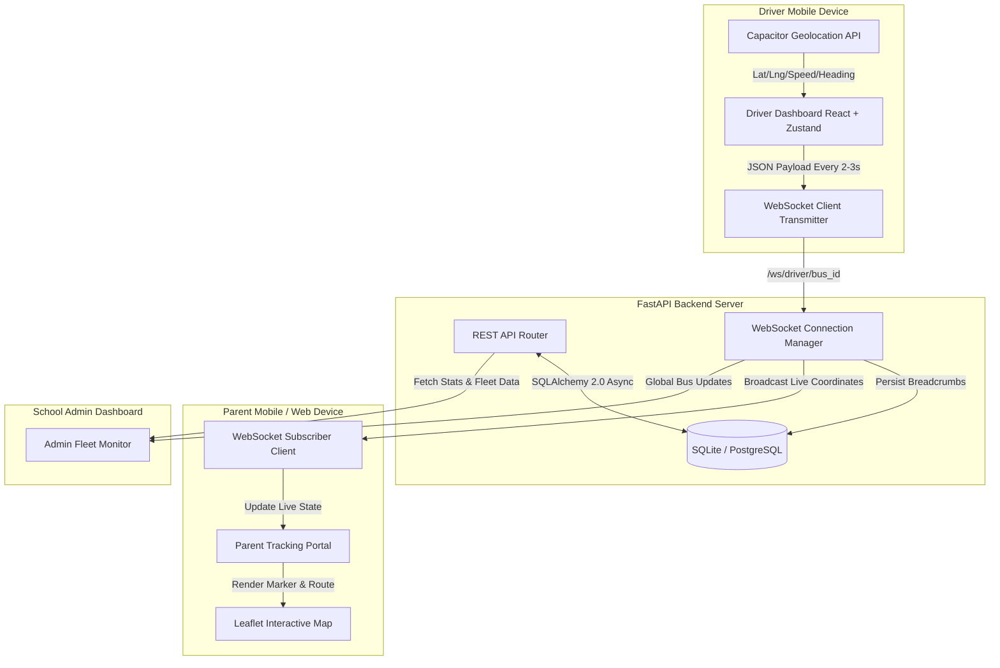

# 🚌 YellowBird — Real-Time School Bus Tracking System

<div align="center">

**A production-ready, zero-hardware school bus tracking platform with real-time GPS streaming, native Android mobile apps, and parent notifications.**

[](#-tech-stack)
[-009688?logo=fastapi&logoColor=white)](#-tech-stack)
[](#-mobile-app-android)
[](#-real-time-websocket-architecture)
[](#)

</div>

---

## 📖 Table of Contents

- [Overview](#-overview)
- [Key Features](#-key-features)
- [System Architecture](#-system-architecture)
- [Tech Stack](#-tech-stack)
- [Project Directory Structure](#-project-directory-structure)
- [User Roles & Portals](#-user-roles--portals)
- [Real-Time WebSocket Architecture](#-real-time-websocket-architecture)
- [Trip Lifecycle & Safety Architecture](#-trip-lifecycle--safety-architecture)
- [Mobile App (Android)](#-mobile-app-android)
- [Getting Started](#-getting-started)
  - [Prerequisites](#prerequisites)
  - [1. Backend Setup](#1-backend-setup)
  - [2. Frontend Web Setup](#2-frontend-web-setup)
  - [3. Android APK Build](#3-android-apk-build)
  - [4. Docker Deployment](#4-docker-deployment)
- [Network & Field Testing Modes](#-network--field-testing-modes)
- [API Reference](#-api-reference)
- [Demo Credentials](#-demo-credentials)
- [Troubleshooting & FAQ](#-troubleshooting--faq)
- [Contributing & License](#-contributing--license)

---

## 🎯 Overview

Traditional school bus tracking requires installing dedicated, costly GPS hardware into every bus with recurring monthly tracking subscriptions.

**YellowBird solves this with a modern, software-driven approach:**
- **Zero Hardware Investment**: Turns any driver’s smartphone into an accurate GPS transmitter.
- **Sub-Second Streaming**: Broadcasts live coordinates, speed, and heading over persistent WebSockets every 2–3 seconds.
- **Parent Peace of Mind**: Interactive live map showing the bus gliding smoothly, accurate ETA calculations, and automatic notifications when the bus is approaching pickup stops.
- **Cross-Platform**: Operates as a high-performance web dashboard on desktop and a standalone native Android application on mobile via Capacitor.

---

## ✨ Key Features

### 🚌 Driver Experience
- **One-Tap Trip Start/End**: Instant trip activation with automated status broadcasting.
- **Bulletproof Trip Persistence**: Trips survive app closes, accidental terminations, and phone reboots with automatic state recovery (`localStorage` + `GET /api/v1/tracking/trips/my-active`).
- **Resilient GPS Lock**: Built-in infinite timeout configuration (`timeout: 2147483647`) to prevent satellite drops indoors or during startup delays.
- **Screen Wake Lock**: Keeps the driver's device screen alive during trips to ensure continuous background GPS transmission.
- **Live Route Builder**: Allows drivers or administrators to record brand new bus routes and drop geo-tagged bus stops by driving the physical path.

### 👨‍👩‍👧 Parent Experience
- **Strict Live-Only Bus Visibility**: The bus marker is rendered **only** when the driver is actively on trip and broadcasting live data — eliminating "zombie/stale" bus markers.
- **Instant Map Center & Redirection**: Tapping the **Refresh** button immediately re-centers the map directly to the parent's live GPS position.
- **Dynamic Live ETA & Distance**: Instant Haversine calculations providing real-time distance and arrival estimates.
- **Push & In-App Alerts**: Automated notifications when the bus starts its trip, arrives near the stop (< 500m), and completes the route.
- **Direct Driver Contact**: One-tap phone calling directly from the tracking card.

### 🏫 School & Fleet Management
- **Centralized Fleet Oversight**: Real-time status for all buses, active routes, and drivers.
- **Multi-Child Support**: Parents with multiple students can switch between child buses with a single click.
- **Single-Device Driver Session Enforcement**: Guards against duplicate simultaneous logins, ensuring accurate single-source GPS broadcasting.
- **Automated Stale Trip Cleanup**: Detects and auto-completes abandoned trips older than 12 hours.

---

## 🏗️ System Architecture



---

## 🚀 Tech Stack

### Frontend & Mobile
| Technology | Purpose | Key Details |
|---|---|---|
| **React 19 + TypeScript** | Core UI Library | Strict typing, modern hooks, functional architecture |
| **Capacitor 8** | Native Mobile Runtime | Native Android geolocation, push & local notifications |
| **Vite 6** | Build Tooling | High-speed HMR, optimized production bundling |
| **Tailwind CSS** | Styling System | Responsive mobile-first layout, custom glassmorphism |
| **Zustand** | State Management | Persisted trip store (`yb_active_trip`), auth store |
| **TanStack Query v5** | Server State Sync | Automatic background refetching and caching |
| **Leaflet & React-Leaflet** | Interactive Maps | Custom SVG bus markers, smooth CSS transition easing |
| **Framer Motion** | Micro-Animations | Smooth card collapses, pulsing status halos, modals |

### Backend & Infrastructure
| Technology | Purpose | Key Details |
|---|---|---|
| **FastAPI** | Web Framework | High-performance async Python framework with OpenAPI docs |
| **SQLAlchemy 2.0** | Async ORM | Async engine supporting SQLite (dev) and PostgreSQL (prod) |
| **Native WebSockets** | Real-Time Transport | In-memory broadcast channels with disconnect recovery |
| **JWT (python-jose)** | Authentication | Role-based token authentication with session tokens |
| **Passlib (bcrypt)** | Password Security | Secure password hashing |
| **Docker & Compose** | Containerization | Multi-container full stack deployment |

---

## 📂 Project Directory Structure

```
Real-Time-Bus-Tracker-main/
├── backend/
│   ├── app/
│   │   ├── api/
│   │   │   ├── deps.py             # Auth & RBAC dependencies
│   │   │   └── routes/
│   │   │       ├── auth.py         # Login, register, profile
│   │   │       ├── buses.py        # Bus fleet management
│   │   │       ├── dashboard.py    # Admin overview metrics
│   │   │       ├── drivers.py      # Driver profiles & assignment
│   │   │       ├── notifications.py# Parent & system notifications
│   │   │       ├── parents.py      # Parent profiles & student link
│   │   │       ├── routes.py       # Routes & stop sequences
│   │   │       ├── schools.py      # Multi-school management
│   │   │       ├── students.py     # Student records & stop pairing
│   │   │       ├── tracking.py     # GPS WebSockets & trip lifecycle
│   │   │       └── users.py        # User administration
│   │   ├── core/
│   │   │   ├── config.py           # App settings & env loading
│   │   │   ├── database.py         # Async engine & session factory
│   │   │   ├── routing.py          # Haversine distance functions
│   │   │   └── security.py         # JWT generation & password hashing
│   │   ├── models/                 # SQLAlchemy 2.0 ORM models
│   │   ├── schemas/                # Pydantic schemas (request/response)
│   │   ├── websockets/
│   │   │   └── manager.py          # ConnectionManager for live bus channels
│   │   ├── main.py                 # FastAPI application entry point
│   │   └── seed.py                 # Seed script for initial demo data
│   ├── requirements.txt            # Python dependencies
│   └── venv/                       # Local Python virtual environment
│
├── frontend/
│   ├── android/                    # Capacitor Android Studio native project
│   │   └── app/build/outputs/apk/  # Compiled Android APK (debug)
│   ├── public/                     # Static assets, icons, notification badges
│   ├── src/
│   │   ├── components/             # Reusable UI components & layouts
│   │   ├── pages/
│   │   │   ├── auth/LoginPage.tsx  # Multi-role login portal
│   │   │   ├── driver/             # Driver dashboard, routes, passengers
│   │   │   ├── parent/             # Live tracking tab, alerts, children
│   │   │   └── ...                 # Admin dashboards, fleets, routes
│   │   ├── stores/                 # Zustand stores (tripStore, authStore)
│   │   ├── lib/                    # Axios API client, WebSocket manager
│   │   └── types/                  # TypeScript interfaces
│   ├── capacitor.config.ts         # Capacitor native bridge configuration
│   ├── package.json                # NPM dependencies & build scripts
│   └── vite.config.ts              # Vite configuration
│
└── docker/
    └── docker-compose.yml          # Containerized deployment
```

---

## 👥 User Roles & Portals

```
┌─────────────────────────────────────────────────────────────────┐
│                      YellowBird Platform                        │
├─────────────────┬─────────────────┬──────────────┬──────────────┤
│   Super Admin   │  School Admin   │    Driver    │    Parent    │
├─────────────────┼─────────────────┼──────────────┼──────────────┤
│ • Platform view │ • Manage Fleet  │ • 1-Tap Trip │ • Live Bus   │
│ • School tenant │ • Assign Routes │ • Auto-GPS   │ • Dynamic ETA│
│ • System health │ • Manage Users  │ • Passengers │ • Stop Alert │
│ • Global stats  │ • Stop Mapping  │ • Wake Lock  │ • Call Driver│
└─────────────────┴─────────────────┴──────────────┴──────────────┘
```

1. **Super Admin**: Manages school subscriptions, cross-school analytics, and global administrators.
2. **School Admin**: Manages drivers, buses, student assignments, pickup stops, and live fleet monitoring.
3. **Driver**: Minimalist mobile dashboard designed for single-tap operations while operating the vehicle safely.
4. **Parent**: Consumer-grade tracking view with real-time map updates, notifications, and proximity alerts.

---

## 📡 Real-Time WebSocket Architecture

YellowBird uses dedicated WebSocket channels managed by `ConnectionManager`:

1. **Driver GPS Broadcasting**:
   - Driver connects to: `/api/v1/tracking/ws/driver/{bus_id}?token={JWT}`
   - Sends telemetry payload every 2–3 seconds:
     ```json
     {
       "latitude": 28.6139,
       "longitude": 77.2090,
       "speed": 34.5,
       "heading": 182.0,
       "accuracy": 5.2,
       "trip_id": "b58fbdea-32b0-462f-9515-403c72644397"
     }
     ```
2. **Parent Live Subscription**:
   - Parent connects to: `/api/v1/tracking/ws/track/{bus_id}`
   - Receives immediate broadcast on change and caches last known fix in memory.
3. **Admin Global Fleet Channel**:
   - Admins connect to: `/api/v1/tracking/ws/track_all`
   - Receives aggregated updates across all active buses simultaneously.

---

## 🛡️ Trip Lifecycle & Safety Architecture

To guarantee absolute reliability on unreliable mobile cellular connections:

- **Duplicate Trip Prevention**: When `/api/v1/tracking/trips/start` is called, the backend queries for any active `IN_PROGRESS` trips for that driver. If one is already running, it returns the existing trip instead of generating duplicate database entries.
- **Client Auto-Resume**: The driver dashboard queries `GET /api/v1/tracking/trips/my-active` upon loading. If an in-progress trip is detected on the server, the app resumes GPS streaming immediately without driver intervention.
- **Stale Trip Auto-Cleanup**: The server identifies any active trip older than 12 hours and automatically completes it.
- **Timezone-Safe Normalization**: All database timestamp comparisons utilize UTC conversion (`_calculate_trip_age_hours`), avoiding errors across SQLite naive dates and timezone-aware objects.

---

## 📱 Mobile App (Android)

The application includes full native Android support configured via **Capacitor**:

### Features
- **Standalone Distribution**: The debug APK is fully bundled with all assets — no external Vite dev server is required.
- **Hardware Geolocation**: Native GPS integration via `@capacitor/geolocation`.
- **Foreground Service & Wake Lock**: Prevents Android OS from pausing location broadcasts when the driver navigates between tabs.

### APK Output Path
Once compiled, the production-ready Android APK is located at:
```
frontend/android/app/build/outputs/apk/debug/app-debug.apk
```

---

## ⚡ Getting Started

### Prerequisites
- **Python**: 3.10 or higher
- **Node.js**: 18.x or higher
- **Java / Android Studio** (Optional, for building Android APK): JDK 17+

---

### 1. Backend Setup

```bash
# Navigate to backend directory
cd backend

# Create and activate Python virtual environment
python -m venv venv
# On Windows:
venv\Scripts\activate
# On Linux/macOS:
source venv/bin/activate

# Install dependencies
pip install -r requirements.txt

# Start the development server
uvicorn app.main:app --host 0.0.0.0 --port 8000 --reload
```
> **API Documentation**: Open your browser to `http://localhost:8000/docs` for interactive Swagger documentation. Demo data automatically seeds on the first launch.

---

### 2. Frontend Web Setup

```bash
# Navigate to frontend directory
cd frontend

# Install Node dependencies
npm install

# Start the Vite dev server
npm run dev
```
> Access the web portal at `http://localhost:5173`.

---

### 3. Android APK Build

To compile a standalone Android APK:

```bash
cd frontend

# Build frontend production bundle
npm run build

# Sync assets to native Android project
npx cap sync

# Compile APK using Gradle (Windows PowerShell example)
cd android
$env:JAVA_HOME="C:\Program Files\Android\Android Studio\jbr"
.\gradlew.bat clean assembleDebug
```

Your compiled APK will be ready at:
`frontend/android/app/build/outputs/apk/debug/app-debug.apk`

---

### 4. Docker Deployment

To launch the entire platform (FastAPI backend + frontend) with a single command:

```bash
docker compose -f docker/docker-compose.yml up --build -d
```

---

## 🌐 Network & Field Testing Modes

Depending on how you are testing, configure `frontend/.env`:

| Scenario | `VITE_API_URL` Configuration | How to Run |
|---|---|---|
| **Local Web Browser Dev** | *Leave commented out* | Vite dev server proxies requests automatically to `localhost:8000`. |
| **Local Wi-Fi Testing (APK on Phone)** | `VITE_API_URL=http://<YOUR_LOCAL_IP>:8000` | Ensure laptop and phone are on the same Wi-Fi network. Find your IP with `ipconfig` (Windows) or `ifconfig` (macOS/Linux). |
| **Field 4G Cellular Testing** | `VITE_API_URL=https://<YOUR_TUNNEL>.loca.lt` | Expose backend via localtunnel: `npx localtunnel --port 8000`. |

---

## 🔌 API Reference

### Authentication
- `POST /api/v1/auth/login` — Authenticate and receive JWT access token.
- `GET /api/v1/auth/me` — Retrieve logged-in user profile.
- `POST /api/v1/auth/register` — Register a new account (Admin role required).

### GPS & Trips
- `POST /api/v1/tracking/trips/start` — Start a new trip (sets bus/driver status to `ON_TRIP`).
- `POST /api/v1/tracking/trips/{id}/end` — Complete trip and reset statuses.
- `GET /api/v1/tracking/trips/my-active` — Get active trip for the logged-in driver.
- `GET /api/v1/tracking/trips/active` — List all currently active trips.
- `WS /api/v1/tracking/ws/driver/{bus_id}` — Driver GPS ingestion stream.
- `WS /api/v1/tracking/ws/track/{bus_id}` — Subscriber real-time bus location channel.

### Fleet & Management
- `GET /api/v1/parents/me/bus-info` — Full interconnection payload for parents (students, stops, bus, driver).
- `GET/POST/PATCH/DELETE /api/v1/buses` — Bus fleet operations.
- `GET/POST/PATCH/DELETE /api/v1/routes` — Routes and stop sequences.
- `GET/POST/PATCH/DELETE /api/v1/students` — Student enrollment and bus assignment.
- `GET /api/v1/notifications` — Notification inbox for logged-in user.

---

## 🔑 Demo Credentials

The system seeds default demo accounts on first setup:

| Role | Email | Password | Assigned Details |
|---|---|---|---|
| **Super Admin** | `superadmin@smarttransport.com` | `admin123` | Platform oversight |
| **School Admin** | `admin@greenfield.edu.in` | `admin123` | Greenfield School Admin |
| **School Admin** | `admin@dps.edu` | `admin123` | Delhi Public School Admin |
| **Driver** | `bus111@gmail.com` | `driver123` | Driver for Bus 111 (BUS-001) |
| **Driver** | `driver1@greenfield.edu.in` | `driver123` | Route 1 Driver (Tata Starbus) |
| **Driver** | `driver2@greenfield.edu.in` | `driver123` | Route 2 Driver (Ashok Leyland) |
| **Parent** | `sachin.shelke@gmail.com` | `parent123` | Parent of Raj Shelke |
| **Parent** | `parent1@gmail.com` | `parent123` | Parent of Student (Anita Verma) |
| **Parent** | `parent2@gmail.com` | `parent123` | Parent of Student (Vikram Singh) |

---

## 🛠️ Troubleshooting & FAQ

### 1. Driver APK shows "Network Error" or cannot reach the server
- **Wi-Fi Mode**: Verify that your laptop and mobile phone are connected to the exact same Wi-Fi network. Ensure `VITE_API_URL` in `frontend/.env` matches your laptop's current IPv4 address (run `ipconfig` on Windows or `ifconfig` on macOS/Linux).
- **Firewall**: Ensure Windows Firewall permits incoming connections on port `8000`. Run the backend with `--host 0.0.0.0` so it listens on all interfaces.
- **Rebuild APK**: Whenever changing `VITE_API_URL`, you must rebuild and sync:
  ```bash
  cd frontend
  npm run build
  npx cap sync
  cd android && .\gradlew.bat clean assembleDebug
  ```

### 2. Location permissions on Android
- Grant **Precise Location** permission when prompted on first launch.
- If GPS fixes take time indoors, step near a window or outdoors to allow satellite acquisition.

### 3. Parent cannot see bus on the map
- The bus marker only appears when the assigned driver has clicked **"Start Trip"** and is actively streaming live coordinates.
- If the driver has not started a trip, the map displays a friendly *"Bus is currently offline / awaiting trip departure"* status badge, and the map focuses on the parent's home/current location.
- Clicking the **Refresh** button on the parent screen instantly re-centers and animates directly to the parent's live GPS coordinates.

### 4. Port 8000 or 5173 already in use
- **Kill existing backend process on Windows**:
  ```powershell
  Get-Process -Id (Get-NetTCPConnection -LocalPort 8000).OwningProcess | Stop-Process -Force
  ```
- **Kill existing frontend dev server**:
  ```powershell
  Get-Process -Id (Get-NetTCPConnection -LocalPort 5173).OwningProcess | Stop-Process -Force
  ```

---

## 📄 Contributing & License

Contributions, issues, and feature requests are welcome!

Distributed under the **MIT License**. See `LICENSE` for more information.
